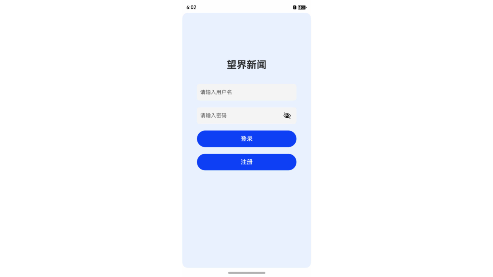
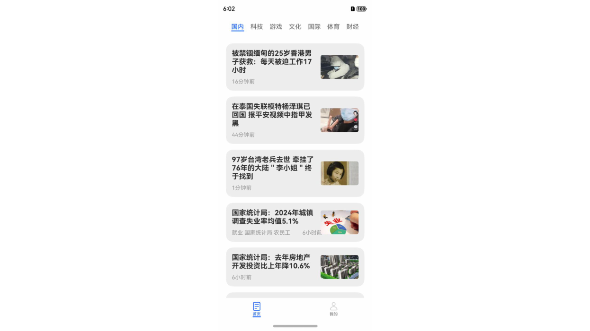
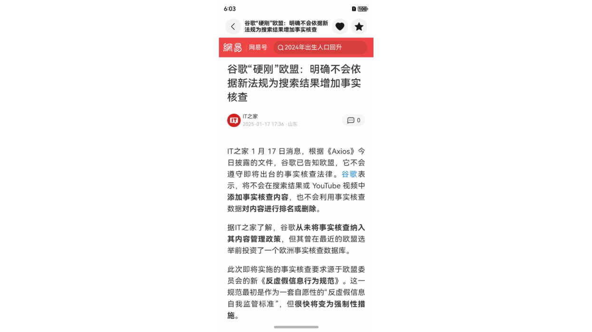
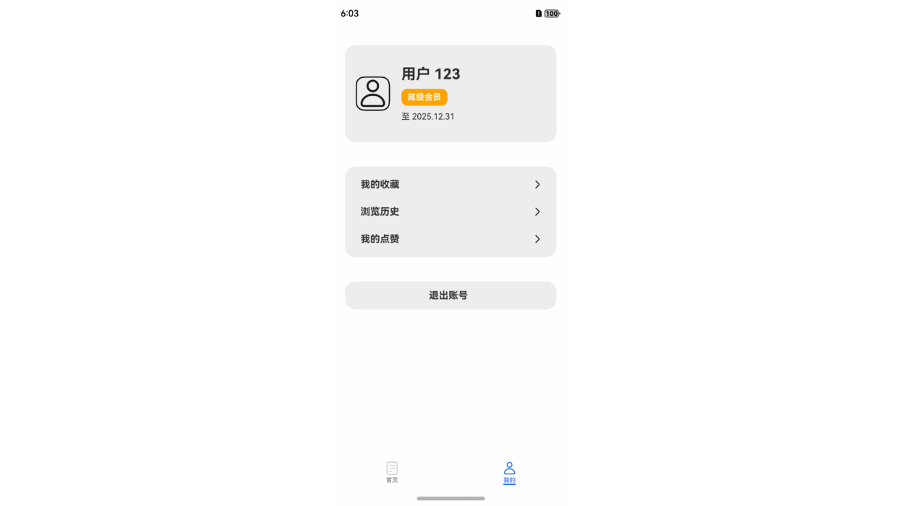
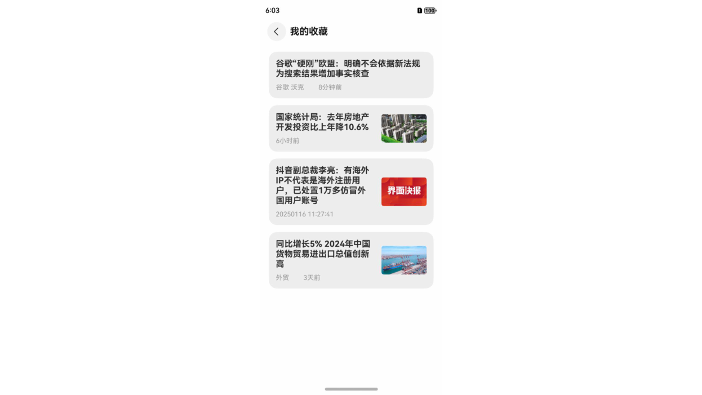

# 项目介绍文档

## 一、成员信息

组长：221250147吕炳蓁

组员：221250142顾益铭，221250143孟昭辰，221250148黄瑞申，221250149山雨冬

## 二、项目概述

本应用是一款基于客户端-服务器模式开发的新闻浏览软件。服务器端采用Spring Boot架构，移动端使用ArkTS语言进行开发，旨在为用户提供便捷的新闻浏览体验，并具备完善的用户管理、数据存储与交互以及错误处理机制。

## 三、功能介绍

服务器端功能。1.提供了RESTful API接口，与移动端进行通信。2.实现了用户的注册与登录、新闻获取与管理等功能。3.使用MySQL数据库存储用户、新闻等数据。4.提供错误处理机制，便于客户端能够有效处理错误。

移动端功能。1.登录与注册，用户可以注册账号、登录账号。2.新闻列表，首页包括国内、科技、游戏等类别，用户可以切换类别查看不同类型的新闻。3.新闻详情，用户点击新闻列表项，跳转到新闻详情页，查看新闻正文内容。4.点赞收藏、历史记录，用户可以给感兴趣的新闻点赞、收藏等，应用程序也会记录用户的浏览记录；进入“我的”页面可以查看点赞、收藏、历史记录列表。

## 四、交互方式

打开应用后，用户首先进入登录页，可以输入账号密码登录；或点击注册按钮前往注册页注册账号，注册成功后返回登录页登录。

登录成功后进入首页，客户端从服务器获取新闻数据，然后以列表的形式呈现给用户。首页分为国内、科技、游戏等不同类别的新闻栏目，可以左右滑动屏幕切换栏目。各栏目下有对应类别的新闻列表，用户可以上下滑动屏幕查看新闻列表项，并可以点击新闻列表项跳转查看新闻详情。

在新闻详情页面，用户可以点击右上角按钮，对本条新闻进行点赞或收藏；点击左上角返回按钮，可以回到首页。

用户还可以切换到“我的”页面，查看个人信息、历史浏览记录、点赞和收藏的新闻等内容。

